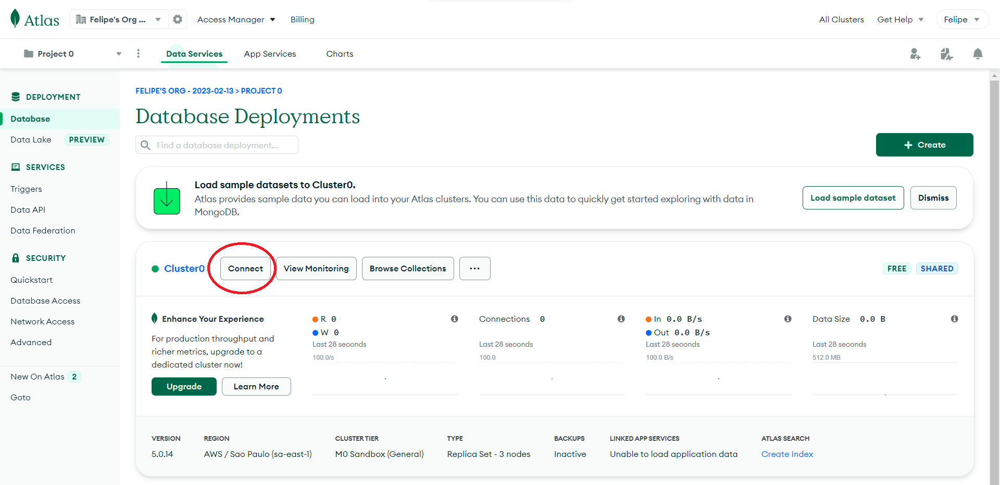

<h1 align="center">🐝 Welcome to Bee-Planner 🐝</h1>

> This planner will help the client to organize his week, his tasks and at what times they happen.

### 🏠 [API Link on Heroku](https://compass-challenge2.herokuapp.com/api/v1)

## Install

Make sure to have Git, Node.js and npm installed and use your terminal to follow the steps below:

```sh
git clone https://github.com/bee-squad/Challenge2_week8.git
cd Challenge2_week8/
npm install
```

## Getting Started

First you will need to create a MongoDB Atlas Cluster following this 9 steps:

<table><tr>
<td>  </td>
<td>  </td>
<td>  </td>

</tr></table>
<table><tr>
<td>  </td>
<td>  </td>
<td>  </td>

</tr></table>
<table><tr>
<td>  </td>
<td>  </td>
<td>  </td>

</tr></table>

```bash
  1 - Go to https://www.mongodb.com/cloud/atlas/register to register and sign in.
  2 - After Sign in, choose the last option to create a Free Database.
  3 - Select the Free (Shared Option) and click "Create Cluster".
  4 - Create a User setting up an username and password (do not forget to save this password)
  5 - Add a new entry to IP Access List (0.0.0.0/0), and click "Finish and Close".
  6 - After the last step, click "Connect".
  7 - Now click "Connect you application".
  8 - Copy the connection string.
  9 - Back to the code, create a .env file and set it up like ".env.example" example, paste the connection string from last step and change "<password>" with the password you created before on step 4.
```

## Usage

Now that you created the .env file, just run the codes below:

```sh
npm run build
npm start
```

## API Documentation

For all routes, use this address: 127.0.0.1:PORT (3000 in our example) before. For example to get all events you have to
do a get request like this: 127.0.0.1:3000/api/v1/events.

## GET Routes

#### Return all Events (Needs AUTH)

```http
  GET /api/v1/events
```

#### Return a specific Event (Needs AUTH)

```http
  GET /api/v1/events?id=
```

| Query Parameter | Type     | Description                            |
| :-------------- | :------- | :------------------------------------- |
| `id`            | `string` | **Required**. Event ID you want to get |

#### Return all Event(s) by the day of the week (Needs AUTH)

```http
  GET /api/v1/events?dayOfTheWeek=0
```

| Query Parameter                                                   | Type     | Description                                                                           |
| :---------------------------------------------------------------- | :------- | :------------------------------------------------------------------------------------ |
| `Sunday, Monday, Tuesday, Wednesday, Thursday, Friday, Saturday ` | `string` | **Required**. It will return all events where dateTime is on the same day of the week |

## POST Routes

#### User Sign Up

```http
  POST /api/v1/users/signUp
```

| Body              | Type     | Description                    |
| :---------------- | :------- | :----------------------------- |
| `firstName`       | `string` | **Required**. First Name       |
| `lastName`        | `string` | **Required**. Last Name        |
| `birthDate`       | `Date`   | **Required**. Birth Date       |
| `city`            | `string` | **Required**. City             |
| `country`         | `string` | **Required**. Country          |
| `email`           | `string` | **Required**. E-mail           |
| `password`        | `string` | **Required**. Password         |
| `confirmPassword` | `string` | **Required**. Confirm Password |

#### User Sign In

```http
  POST /api/v1/users/signIn
```

| Body       | Type     | Description            |
| :--------- | :------- | :--------------------- |
| `email`    | `string` | **Required**. E-mail   |
| `password` | `string` | **Required**. Password |

#### Create Event (Needs AUTH)

```http
  POST /api/v1/events/
```

| Body          | Type     | Description                                                         |
| :------------ | :------- | :------------------------------------------------------------------ |
| `description` | `string` | **Required**. Event Description                                     |
| `dateTime`    | `Date`   | **Required**. Event DateTime - Example : '2023-02-12T22:03:47.262Z' |

## PATCH Routes

#### Update User (Needs AUTH)

```http
  PATCH /api/v1/users
```

| Body        | Type     | Description              |
| :---------- | :------- | :----------------------- |
| `firstName` | `string` | **Optional**. First Name |
| `lastName`  | `string` | **Optional**. Last Name  |
| `birthDate` | `Date`   | **Optional**. Birth Date |
| `city`      | `string` | **Optional**. City       |
| `country`   | `string` | **Optional**. Country    |
| `email`     | `string` | **Optional**. E-mail     |

#### Update User Password (Needs AUTH)

```http
  PATCH /api/v1/users/updatePassword
```

| Body              | Type     | Description                             |
| :---------------- | :------- | :-------------------------------------- |
| `password`        | `string` | **Required**. Current Password          |
| `newPassword `    | `string` | **Required**. New Password              |
| `confirmPassword` | `string` | **Required**. New Password Confirmation |

## DELETE Routes

#### Delete Current User (Needs AUTH)

```http
  DELETE /api/v1/users
```

#### Delete a specific Event (Needs AUTH)

```http
  DELETE /api/v1/events?id=
```

| Query Parameter | Type     | Description                               |
| :-------------- | :------- | :---------------------------------------- |
| `id`            | `string` | **Required**. Event ID you want to delete |

#### Delete all Event(s) by the day of the week (Needs AUTH)

```http
  DELETE /api/v1/events?dayOfTheWeek=
```

| Parameter                                                        | Type     | Description                                                                                                                   |
| :--------------------------------------------------------------- | :------- | :---------------------------------------------------------------------------------------------------------------------------- |
| `Sunday, Monday, Tuesday, Wednesday, Thursday, Friday, Saturday` | `string` | **Required**. Starting on 0 (Sunday) to 6 (Saturday), it will delete all events where dateTime is on the same day of the week |

## Author

👤 **Bee Squad**

- Github: [@bee-squad](https://github.com/bee-squad)
- Repository: [Challenge2_week8](https://github.com/bee-squad/Challenge2_week8/)

---
